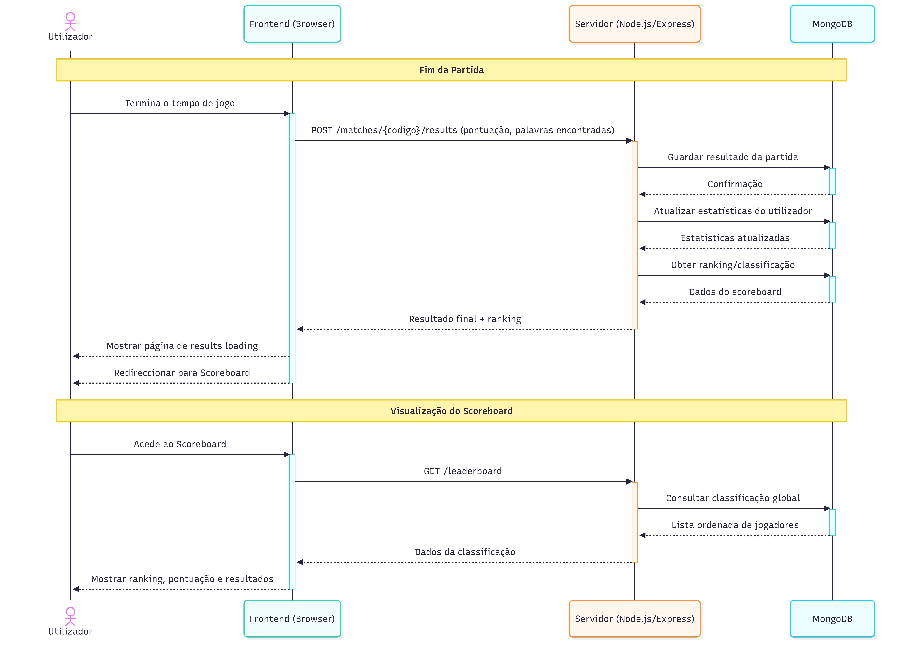

# Matrioska

Projeto desenvolvido no âmbito da disciplina de Desenvolvimento Baseado na Web (DBW) 2026.

## Grupo
- Afonso Camoes - 2123322
- Rafael Vieira Silva - 2176524
- Teresa Silva - 2028815
  
## Protótipo (Figma)

https://www.figma.com/proto/9WQMXkhvHajC7p8u6XquYu/Matrioska?node-id=156-41&t=pMea9yYYfNJapb3R-1

## Descrição

Matrioska é um jogo multijogador de agilidade linguística onde os jogadores recebem uma Palavra-Mestra e têm 30 segundos para descobrir o maior número possível de subpalavras válidas.

A pontuação é baseada no número de letras de cada palavra correta, sendo penalizadas palavras inválidas (-2 pontos).

## Documentação

Os diagramas abaixo representam o funcionamento do sistema considerando a arquitetura final com Backend (API) e base de dados.

## Diagramas de Sequência

### Autenticação

### Criar Partida + Lobby

### Game Screen

### Resultados / Scoreboard

